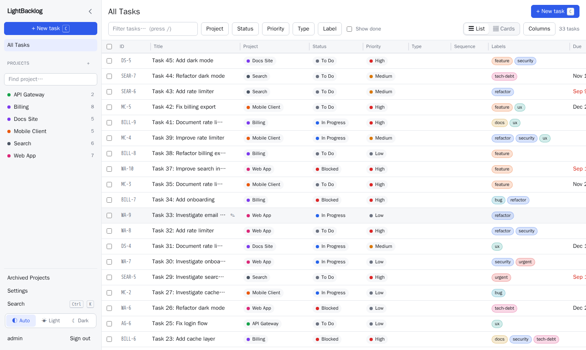

# LightBacklog

A lightweight, self-hosted task manager for many software projects. It is built for people **and** AI coding
agents: a fast browser UI on top, and a documented REST API plus an MCP server underneath, both backed by the
same business logic. One small container, no database server, about 5 to 20 MB of RAM.

- **Browser UI:** an All Tasks workspace with inline editing and filters, a Kanban board, rich-text task
  descriptions with screenshot paste, a command palette, live updates, light and dark theme, and a layout that
  works on phones.
- **For AI agents:** an MCP server (18 tools) and a REST API (46 operations, OpenAPI spec in
  [`internal/api/openapi.yaml`](internal/api/openapi.yaml)). Agents get scoped API tokens. See
  [docs/agents.md](docs/agents.md).
- **Simple to run:** a single static Go binary with the frontend embedded, SQLite storage (WAL, full-text
  search), automatic schema migrations, and built-in backup and restore.
- **Multi-user:** projects with owner, editor and viewer roles.

## Requirements

To run LightBacklog you only need:

| Requirement | Notes |
|---|---|
| Linux (or any host that runs Docker) | Tested on Linux |
| Docker with the Compose plugin (v2) | The image builds the frontend and the server itself. No Go, Node or database is needed on the host. |
| About 128 MB of RAM and a little disk | Data is one SQLite file plus uploads |
| `make` and `git` (optional) | Only for the `make up` shortcut and cloning. `docker compose up -d --build` works without `make`. |
| A reverse proxy with HTTPS | Only if you expose it beyond your own machine. The app speaks plain HTTP on `127.0.0.1:8100`. |

To build without Docker you need Go 1.26 and Node 22.

To install and run it, see [INSTALL.md](INSTALL.md).

## Changelog

The full history is in [CHANGELOG.md](CHANGELOG.md). Latest: **1.0.0**.

## License

[MIT](LICENSE). Security issues: see [SECURITY.md](SECURITY.md).
